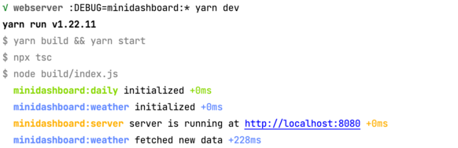

# mini.loca dashboard

the dashboard uses an expressjs webserver running on port 8080. 
it also opens a websocket on port 8082 which can be used for displaying alerts from outside
e.g. from an automation.

use automation and when after selection of trigger and device
just click on 

  

Then remove the scenes by clicking the (x)
Choose Web on the right side and


Fill out the fields as follows  


the webserver itself has some built-in alerts which can be configured in index.js.
additionally the server provides weather information. automatically updated every hour
and can be read by /v1/weather

Please use your own latitude, longitude and openweather api key.


## webserver

```bash
yarn dev # builds and starts only webserver for testing
```

```bash
yarn build # build the webserver (typescript to javascript)
```

```bash
yarn start # start the webserver (needs previous build)
```

The module uses the debug library which is really awesome.
To enable output just set environment to `DEBUG=minidashboard:*`

e.g. 
```bash
DEBUG=minidashboard:* yarn start
```

will look like  


