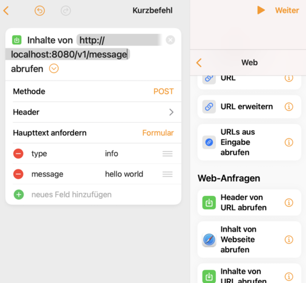

# express webserver + websocket

use automation and when after selection of trigger and device
just click on 

  

Then remove the scenes by clicking the (x)
Choose Web on the right side and

Fill out the fields as follows  

